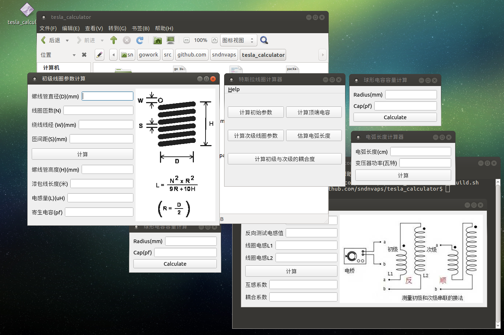

# Tesla_calculator

用于计算特斯拉线圈各项参数的小计算工具,基于[goqt](https://github.com/visualfc/goqt)开发


更新 [images](images)目录里面的图片的时候，需要使用[go-bindata](https://github.com/go-bindata/go-bindata)

```bash
go get -u github.com/go-bindata/go-bindata/...
go-bindata -pkg main -o images_bindata.go images  #生成文件为images_bindata.go
```
具备的功能：

    1. 计算初级线圈电感，谐振频率
    2. 计算次级线圈的电感，谐振频率，寄生电容
    3. 计算次级线圈与初级线圈的耦合系数
    4. 计算电弧长度
    5. 计算顶端电容（球形，环形顶端电容）
    6. 计算品质系数Q
    
 
Support platform(Qt 5.11.1)
```
   Linux
   Windows
   Raspberry pi 3b(not test other pi)
 ```

如何编译
   1. 先安装 QT开发环境(现在支持Qt5.11.1)
   2. 安装golang开发环境（现在支持go1.11)
   3. 再安装[goqt](https://github.com/visualfc/goqt)
   4. 执行编译命令 build.[bat|sh] 根据不同的平台进行选择
   5. 最终编译得到的程序为*tesla_calculator*
   
如何打包生成 可运行的程序安装包
   1. Windows平台使用 PowerShell执行 [ExecPack.ps1](ExecPack.ps1) #首先要在Powershell中输入 ‘set-ExecutionPolicy RemoteSigned‘ 命令，再输入Y，以解除系统禁止运行脚本限制
   2. Linux平台运行ExecPack.sh脚本
   3. 如果你的Qt版本不是 5.11.1,你需要更换 [Depends](Depends)目录下面相应的文件
   4. 版本不是5.11.1的时候，还需要更换[Depends\plugins](Depends\plugins)目录下面所对应的系统文件，此目录对应QT安装目录里面的`plugins\platforms`

App Pics



   
## License
#### [MIT](https://sndnvaps.mit-license.org/2017)
